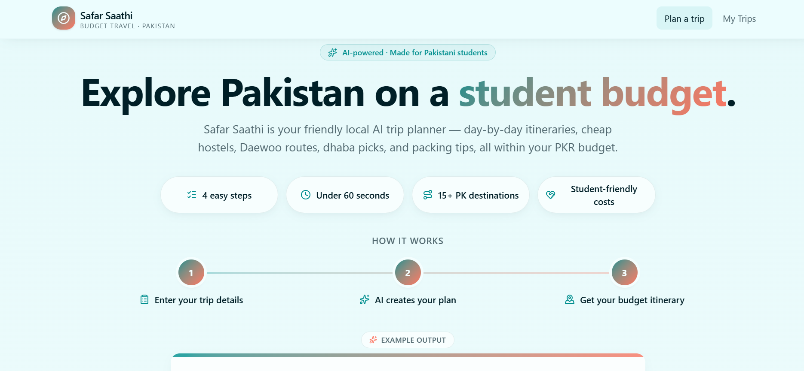
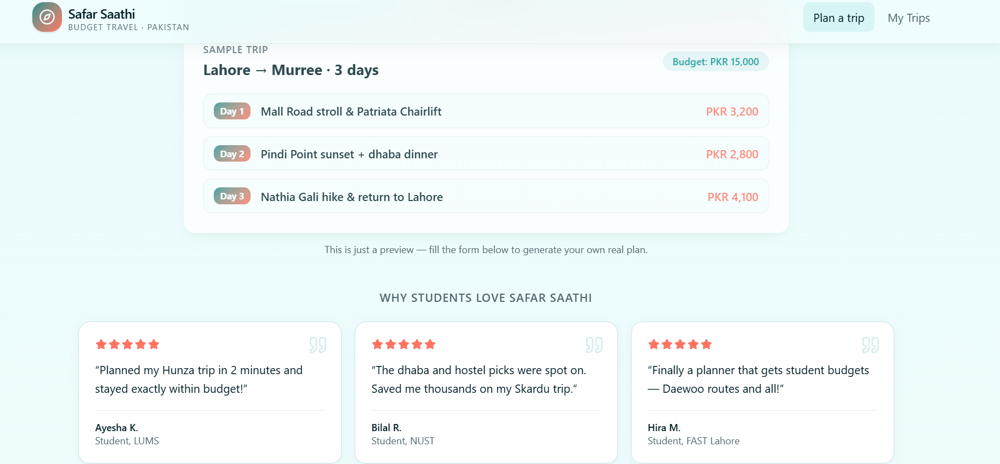
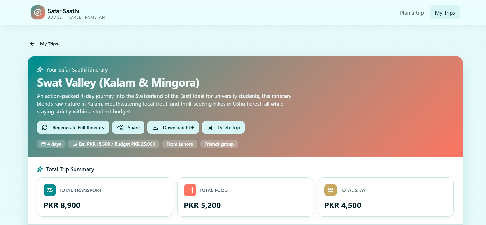
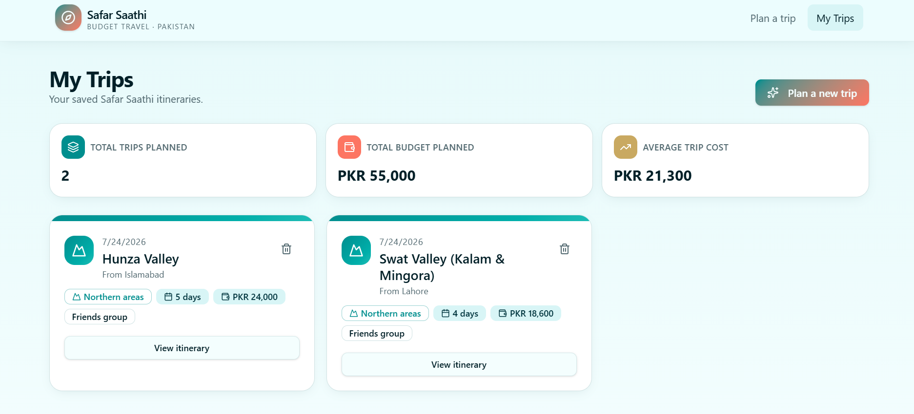

# 🧳 Safar Saathi — AI-Powered Budget Trip Planner for Pakistani Students

**Live App:** [https://safar-saathi-ai.lovable.app](https://safar-saathi-ai.lovable.app)
**GitHub Repo:** [https://github.com/nasrenibrahim923-coder/safar-saathi-ai](https://github.com/nasrenibrahim923-coder/safar-saathi-ai)

---

## 📌 What It Does & The Problem It Solves

**Safar Saathi** ("Travel Companion" in Urdu) is an AI-powered web app that instantly generates a complete, realistic, day-by-day travel itinerary for Pakistani university students — tailored to their starting city, budget in PKR, number of days, interests, and group size. In seconds, a student gets a full plan: which places to visit each day, a cost breakdown (transport, food, stay), practical budget-saving tips, the best time to travel, and a packing checklist.

**Who it's for:** University students in Pakistan — a group that loves to travel but usually has very limited money, little travel experience, and no time to research trip planning from scratch.

**The real problem:** Planning an affordable trip in Pakistan is surprisingly hard for students, for a few concrete reasons:

- **Almost all travel-planning tools are built for a different audience.** Mainstream travel apps and AI travel bots are designed around international tourists. They price everything in USD/EUR, recommend hotels and services that don't exist or aren't accessible in small Pakistani cities, and have no concept of local transport options.
- **Local knowledge is scattered and hard to find.** Information about which bus service is cheapest (Daewoo vs. local vans), which guesthouses are actually affordable, or which local food spots are both cheap and good, is usually only known through word-of-mouth or buried across dozens of blogs, Facebook groups, and YouTube vlogs — not something a student can quickly search and trust.
- **Budgeting a trip manually is time-consuming and error-prone.** A student with, say, PKR 20,000 for a 4-day trip has to manually estimate transport, food, and stay costs for every day, with no easy way to check if the whole trip actually fits their budget before they've already committed money.
- **The result:** many students either overspend and run out of money mid-trip because their budget was based on guesswork, or they simply give up on traveling altogether because the planning process feels overwhelming.

**How Safar Saathi solves it:** instead of generic, one-size-fits-all suggestions, Safar Saathi's AI is instructed to behave like an experienced, budget-conscious *local* Pakistani travel guide. Every itinerary it generates is grounded in PKR pricing, real local transport options (Daewoo/Faisal Movers, shared vans, local buses), and budget-friendly food and stay choices — so a student can go from "I have PKR 25,000 and 4 free days" to a full, realistic, ready-to-follow travel plan in under a minute, without doing any manual research.

---

## 💡 The Idea — Why It's Original

Unlike generic trip planners (which are saturated and mostly wrap a single API call), Safar Saathi is built around a **Pakistan-specific student niche**:
- Local city dropdowns (Lahore, Karachi, Islamabad, Hunza, etc.)
- PKR budget input instead of USD
- Local transport options factored into cost breakdowns (Daewoo, local buses, rickshaws)
- Student-relevant travel styles (Solo backpacking, group trips with friends, family trips)
- A "Surprise Me" destination option for students who don't know where to go but have a fixed budget

---

## ✨ Features

**Landing Page**
- 🎯 **Hero Section with Trust Stats** — a quick stats row highlighting "4 easy steps," "Under 60 seconds," "15+ PK destinations," and "Student-friendly costs"
- 🔢 **"How It Works" Visual Guide** — a clean 3-step walkthrough (Enter trip details → AI creates your plan → Get your budget itinerary) so first-time visitors instantly understand the app
- 👀 **Sample Trip Preview** — a live example itinerary card (e.g., "Lahore → Murree, 3 days") shown right on the landing page, so users can see real output before filling out anything
- ⭐ **Testimonials Section** — student-style reviews building trust and showing the app's value at a glance
- 🌊 **Polished Visual Design** — smooth fade-in animations, card shadows, hover effects on buttons, and a consistent teal-and-coral theme throughout

**Trip Planning**
- 📝 **Smart Trip Form** — starting city, destination (or "Surprise Me"), number of days (slider), budget in PKR, travel interests (Nature, History, Food, Adventure, Religious Sites, Beaches), and group size (Solo/Couple/Friends/Family)
- 🤖 **AI-Generated Day-by-Day Itinerary** — places to visit, cost breakdown (transport/food/stay), budget-saving tips, best time to visit, and a packing checklist
- ✅ **Success Confirmation** — a brief toast notification confirms when a trip has been successfully generated
- 🎴 **Card-Based Itinerary Display** — clean, icon-based day-by-day cards

**On the Itinerary Page**
- 🔄 **Regenerate a Single Day** — regenerate just one day's plan without redoing the whole itinerary
- 🔄 **Regenerate Full Itinerary** — regenerate the entire multi-day plan from scratch using the same inputs
- 🔗 **Share Trip** — copy a shareable link of any trip to the clipboard in one click
- 📄 **Download Itinerary as PDF** — export the full trip plan (itinerary, cost breakdown, budget tips, packing checklist) as a clean, formatted PDF
- 📊 **Budget Usage Bar** — a visual progress bar showing how much of the total budget has been used (e.g., "PKR 21,700 of PKR 25,000 used — 87%")
- 🥯 **Cost Breakdown Donut Chart** — a visual chart splitting the total trip cost into Transport, Food, and Stay, with a labeled legend
- 🧮 **Total Trip Summary** — a quick-glance card showing total transport, food, and stay costs across the whole trip
- 🗑️ **Delete Trip** — remove a saved trip at any time

**My Trips Dashboard**
- 💾 **Save, View & Manage Trips** — all generated itineraries are saved and listed with key details (days, budget, group type)
- 📈 **Dashboard Stats** — total trips planned, total budget planned, and average trip cost, calculated automatically across all saved trips
- 🎨 **Destination-Themed Icons** — each trip card shows a themed icon/accent based on its destination type
- 🈳 **Friendly Empty State** — when there are no saved trips yet, a clear message and a "Plan my first trip" button guide the user, instead of a blank page

**General**
- 📱 **Mobile-Responsive Design** — usable cleanly on any device
- ⏳ **Loading States** — clear feedback while the AI generates a plan

---

## 🤖 The AI Feature (Core of the App)

The heart of Safar Saathi is its AI itinerary generator. When a student fills out the trip form, their inputs are sent to an AI model with the following **system persona/prompt**:

> *You are an experienced, budget-conscious local Pakistani travel guide. Generate a realistic day-by-day itinerary in PKR based on the student's starting city, destination (or suggest one if "Surprise Me" is selected), number of days, total budget, travel interests, and group size. For each day, include: places to visit, a cost breakdown (transport, food, stay), and practical budget tips such as using Daewoo/local buses and affordable hostels. Also include the best time to visit and a packing checklist. Keep all estimates realistic for a student budget in Pakistan.*

This ensures the AI doesn't just generate generic "visit the beach" suggestions — it behaves like a real Pakistani travel guide who understands local transport, pricing, and student budgets.

**Example test run:**
Lahore → Surprise Me → 4 days → PKR 25,000 budget → Friends group → Interests: Nature, Food
✅ AI selected **Abbottabad & Nathia Gali (Galyat Region)** and generated a complete 4-day itinerary — including places like Mushkpuri Top and local food spots, transport/food/stay cost breakdown for each day, a best-time-to-visit recommendation, and a packing checklist — with a total estimated cost of **PKR 15,900**, well within the PKR 25,000 budget.

---

## 🎯 Target Audience

Safar Saathi is designed specifically for:
- University students in Pakistan with limited monthly budgets who still want to travel
- Solo travelers who want a safe, structured plan without hiring a travel agent
- Friend groups or small families planning short domestic trips (2–7 days)
- Anyone who wants a quick, realistic PKR-based plan instead of scrolling through dozens of blogs and forums

---

## 🔄 User Flow (Step-by-Step)

1. **Landing on the app** — the user is greeted with a clean form asking for trip details
2. **Input trip details** — starting city, destination (or "Surprise Me" if undecided), trip length (days), total budget in PKR, travel interests, and group size
3. **AI generation** — on clicking "Generate Itinerary," the app sends these inputs to the AI model, which returns a structured, day-by-day plan
4. **Review itinerary** — the user sees card-based daily plans with places, cost breakdowns, and tips
5. **Refine if needed** — if a specific day doesn't feel right, the user can hit "Regenerate" on just that day, without losing the rest of the plan
6. **Save & manage trips** — the itinerary can be saved to "My Trips" for later reference, or deleted if no longer needed
7. **Export** — the final plan can be downloaded as a clean, formatted PDF for offline access while traveling (useful in areas with poor internet connectivity)

---

## 🧩 Challenges Faced During Development

Building Safar Saathi as a no-code/vibe-coding project came with a few real challenges that were solved during development:

- **Realistic AI outputs:** Early prompts produced generic, non-Pakistan-specific itineraries. This was fixed by rewriting the AI's system persona to explicitly frame it as a *local, budget-conscious Pakistani travel guide*, and by requiring PKR-based cost breakdowns for transport, food, and stay.
- **Budget accuracy:** Getting the AI to stay within the user's stated budget consistently required refining the prompt to explicitly instruct the model to keep total estimated costs at or below the input budget.
- **Navigation & UI flow:** Ensuring smooth transitions between the trip form, itinerary view, and "My Trips" dashboard required testing and adjusting how screens linked to one another.
- **Deployment & version control:** As a no-code build, connecting the Lovable project to GitHub and making the repository public (instead of private) required a few extra configuration steps to ensure the grader could access the code directly.

---

## 🚧 Future Improvements

If continued beyond its current stage as a project, planned improvements include:
- Adding real-time bus/train fare data instead of AI-estimated transport costs
- Allowing multi-destination trips (e.g., a circuit covering 2–3 cities)
- Adding a "share itinerary" feature so friends can view/edit a trip together
- Supporting Urdu-language itinerary generation for wider accessibility
- Adding user accounts/login so trips are saved permanently across devices

---

## 🛠️ Tools & Tech Stack

| Category | Tool/Service |
|---|---|
| App Builder | [Lovable.dev](https://lovable.dev) (no-code/vibe-coding platform) |
| Hosting/Deployment | Lovable built-in hosting |
| Version Control | GitHub (auto-synced from Lovable) |
| AI Model | Google Gemini (accessed via Lovable AI / Lovable Cloud, which powers in-app AI features) |

---

## 📸 Screenshots

**1. Landing Page — Hero, Trust Stats & How It Works**

**2. Landing Page — Sample Trip Preview & Testimonials**

**3. Generated Itinerary — Full Trip Plan with Actions & Cost Summary**

**4. My Trips Dashboard — Saved Trips with Stats**

---

## 🚀 How to Use

1. Visit the live app: [https://safar-saathi-ai.lovable.app](https://safar-saathi-ai.lovable.app)
2. Fill in your starting city, destination (or pick "Surprise Me"), number of days, budget in PKR, interests, and group size
3. Click **Generate Itinerary**
4. Browse your day-by-day plan, regenerate any day you don't like, and save it to **My Trips**
5. Download your itinerary as a PDF anytime for offline access

---

## 👩‍💻 Author

Built by **Nasreen BiBi** as a final project for the ACT AI course (HEC × AI SkillBridge × PMYP).
